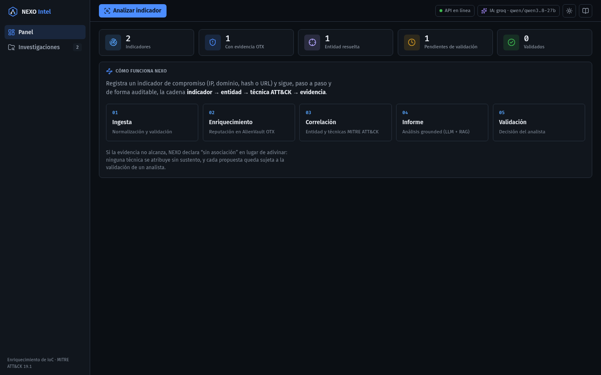
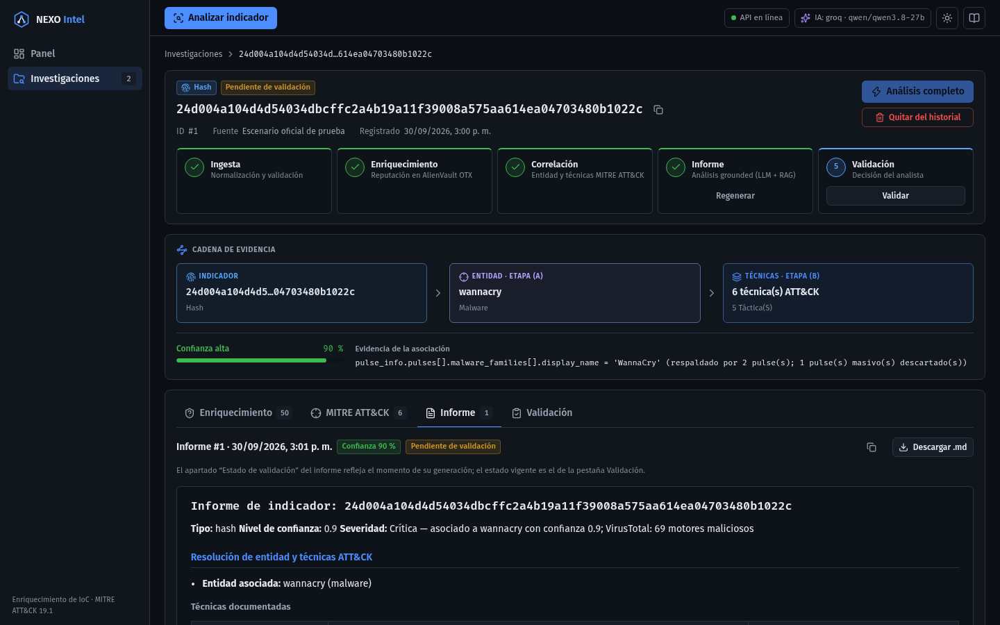
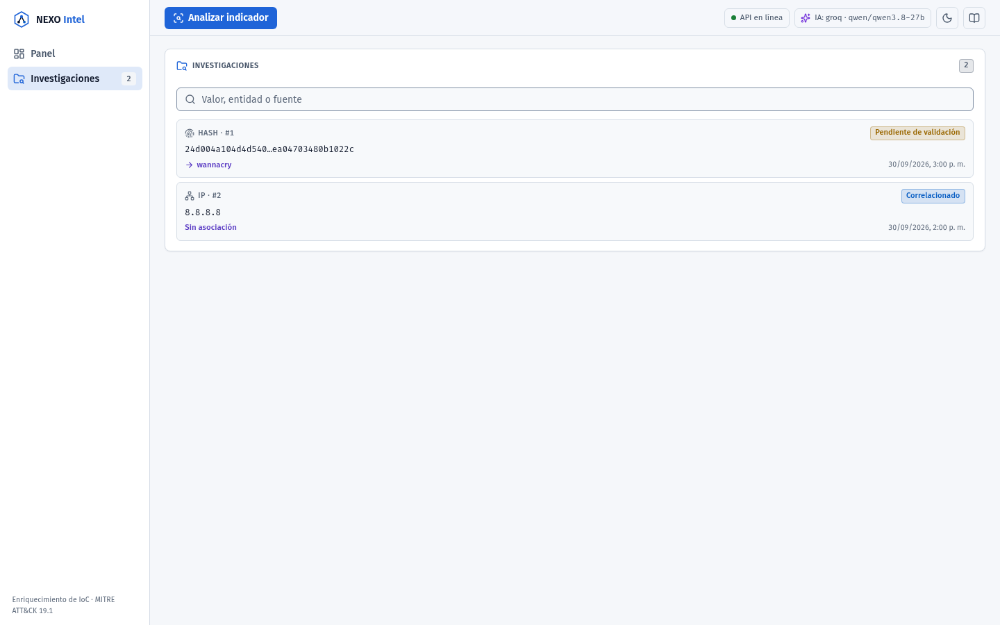
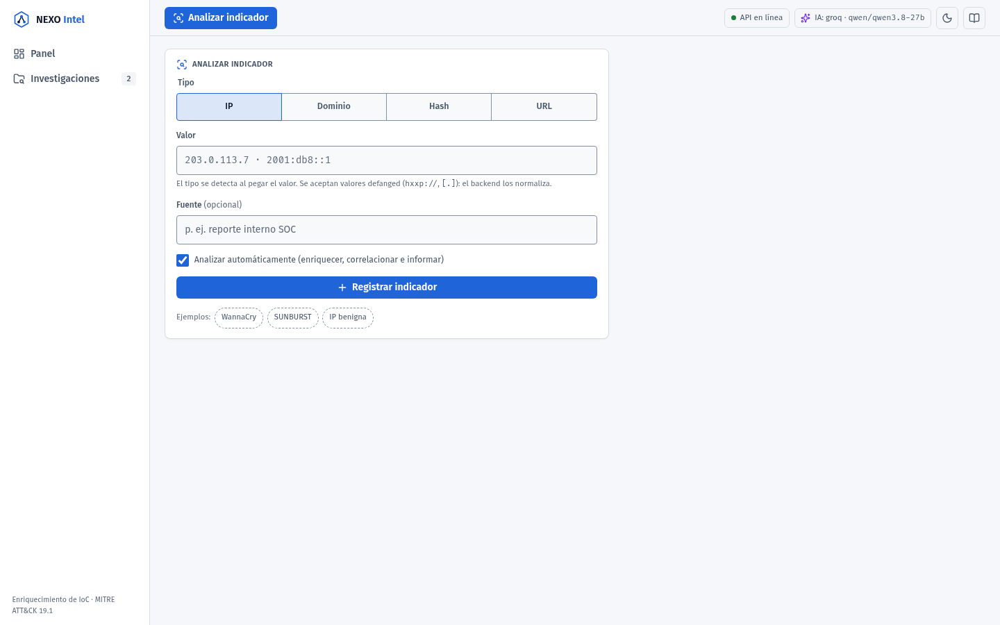
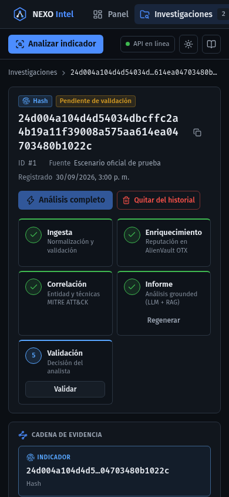

# Fase 5a — Base visual, navegación y contrato

Fecha: 2026-09-30. Diagnóstico y plan en
`nexo-intel-backend/docs/evolucion/fase-00-diagnostico.md` (secciones 11–14).

## Qué cambia

| Área | Antes | Ahora |
|---|---|---|
| Identidad | Estética de consumo: azul `#0071e3`, radios de 28 px, pastillas de 980 px, solo tema claro, base de 16 px | Consola de operación: tokens oscuro/claro, radios de 4/6/8 px, base de 14 px con `tabular-nums`, `--color-ai` reservado para contenido del modelo |
| Navegación | Una sola pantalla con formulario, historial, KPIs y detalle a la vez; sin URL por caso | Barra lateral + cabecera; rutas `#/`, `#/investigaciones`, `#/investigaciones/:id`, `#/analizar`; enlaces directos y botón "atrás" |
| Cabecera | Nombre + estado de la API | Acción principal "Analizar indicador", estado de la API, **proveedor y modelo de IA en uso** (`GET /status`, con el respaldo en el *tooltip*), selector de tema, Swagger |
| Registro | Formulario siempre visible en la barra lateral | Vista `#/analizar`; el **tipo se detecta al pegar** el valor (`detectType`, tolera defang) y el analista puede cambiarlo. Al registrar se abre la investigación |
| Estado | El reducer guardaba `selectedId` | La URL es la única fuente de verdad del caso abierto; se eliminó la selección del estado (sin dos fuentes de verdad) |
| Contrato | Solo OTX | `types.ts` replica `fuentes[]` (F2), `metadatos` del informe (F4) y `GET /status`; el snapshot guarda y persiste `fuentes` (no la respuesta cruda de OTX) |

**Decisiones:**
- **Sin dependencias nuevas.** El router son ~40 líneas sobre `hashchange` +
  `useSyncExternalStore`; los íconos siguen siendo lucide y las fuentes, Fira.
- **Sin modal para el formulario.** jsdom no implementa `showModal()`, y un modal propio
  exige trampa de foco y restauración. Una ruta propia es accesible por defecto,
  enlazable y testeable.
- **El enlace "Saltar al contenido" enfoca `<main>` a mano:** con router por hash, un
  `href="#contenido"` cambiaría de vista.
- **Se conservan los nombres de las variables CSS** y cambian sus valores por tema. Los
  ~15 módulos de los paneles de caso heredan el tema sin tocarse; solo se reemplazaron
  los valores fijos (grises del botón secundario, radios de pastilla).

## Contraste (WCAG AA, medido con script)

| Par | Oscuro | Claro |
|---|---:|---:|
| Texto / muted / subtle sobre panel | 15,0 / 7,2 / 5,3 | 17,9 / 7,6 / 5,4 |
| Info / éxito / aviso / peligro / IA sobre panel | 7,2 / 7,1 / 7,2 / 5,4 / 6,7 | 6,1 / 5,1 / 4,9 / 5,6 / 7,1 |
| Texto del botón primario | 6,0 | 5,4 |
| Borde de inputs (mínimo 3:1 para UI) | 3,17 (se ajustó desde 2,44) | 3,25 |

## Capturas (Chrome headless vía CDP, backend real para `/health` y `/status`)

| | |
|---|---|
|  |  |
|  |  |

Móvil (390 px): 

Correcciones que salieron de las capturas: la columna de `<main>` crecía con valores sin
cortes (hash, URL) y empujaba la página; ahora es `minmax(0, 1fr)`. La marca se partía en
móvil y los campos del formulario medían 42 px (ahora 36).

## Verificación

- `npm run lint`, `npm run typecheck`, `npm run build`: sin errores.
- `npm run coverage`: **120 tests** (92 antes), cobertura 99,1 % sentencias · 96,5 % ramas ·
  99,2 % funciones · 99,3 % líneas (umbral del CI: 90 %).
- `App.test.tsx` reescrito para la navegación: las expectativas de negocio no cambian
  (pipeline, 502 ≠ sin evidencia, 404 → `missing`, 409 abre la investigación existente,
  validación con historial); cambia cómo se llega a cada vista. Nuevos: detección de tipo
  al pegar, ruta a una investigación que no está en el navegador, tema persistido, enlace
  de salto, `fuentes` persistidas sin `detalle`, proveedor de IA ausente si `/status` falla.
- Tests unitarios nuevos: `parseRoute` (10 casos, lo desconocido cae al panel) y
  `detectType` (16 casos).

## Pendiente (F5b)

El detalle todavía es el de antes con los tokens nuevos. Se ve en las capturas:
- el *stepper* de 5 pasos ocupa mucho alto → pipeline compacto en la cabecera del caso;
- falta la severidad, el estado por fuente y la pestaña de Análisis IA con trazabilidad;
- el panel de informe conserva la nota sobre "Estado de validación", sección que el
  backend ya no genera (D20);
- la cabecera del Markdown (Tipo · Confianza · Severidad) se renderiza en un solo
  párrafo: el backend separa esas líneas con un salto simple.
