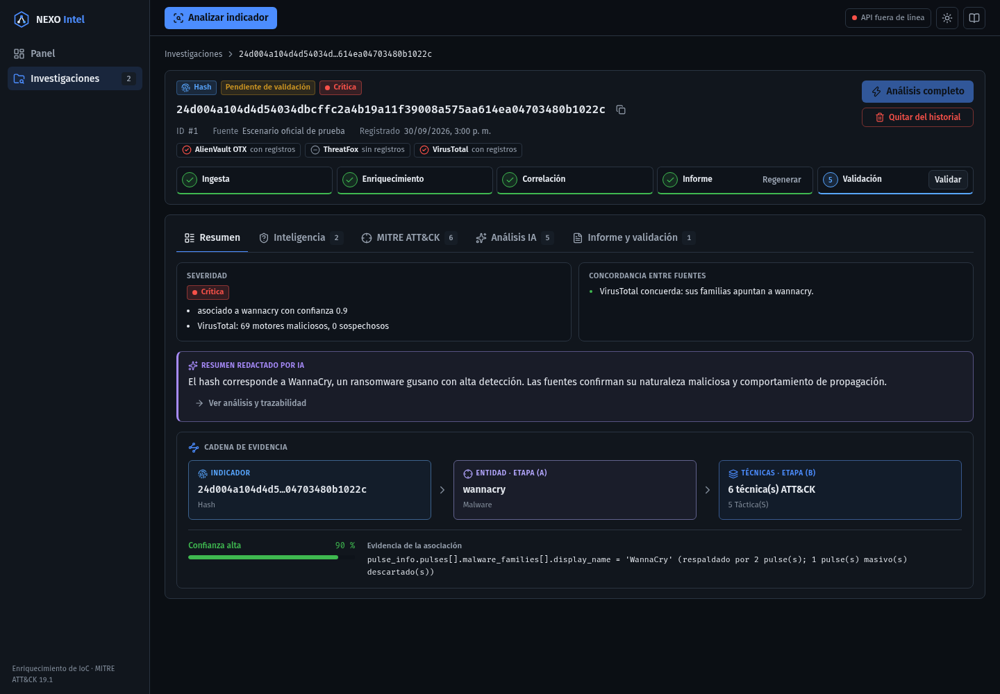
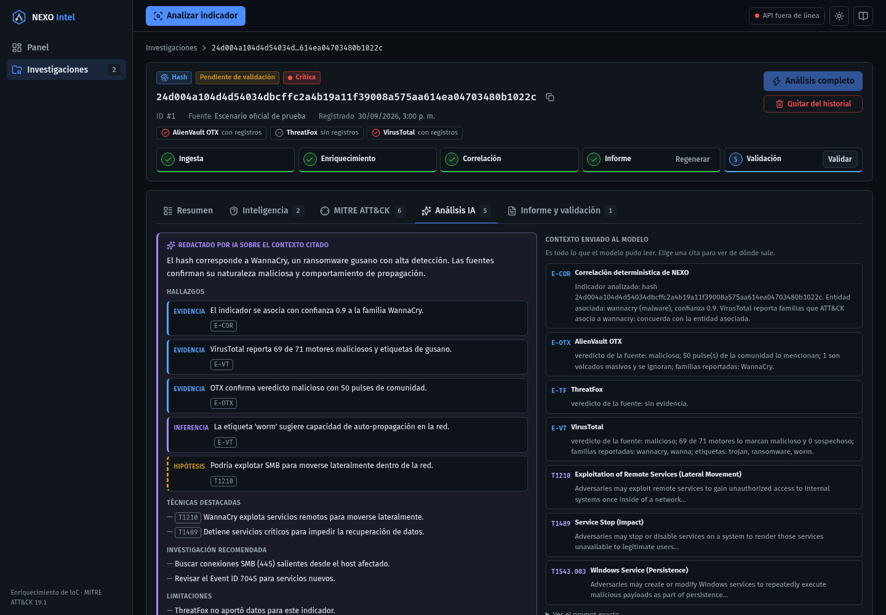
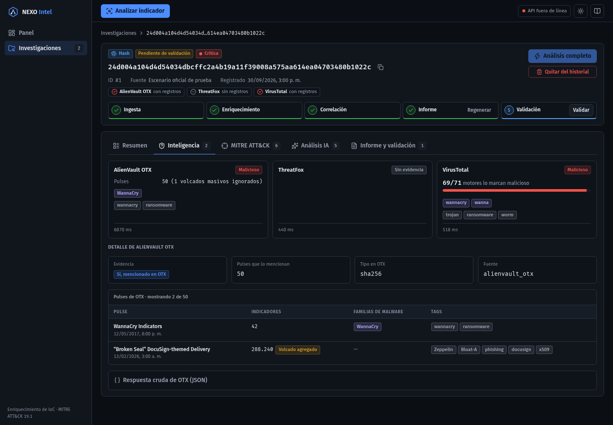
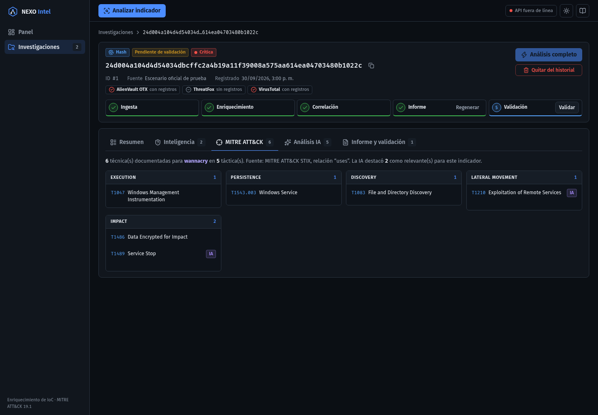
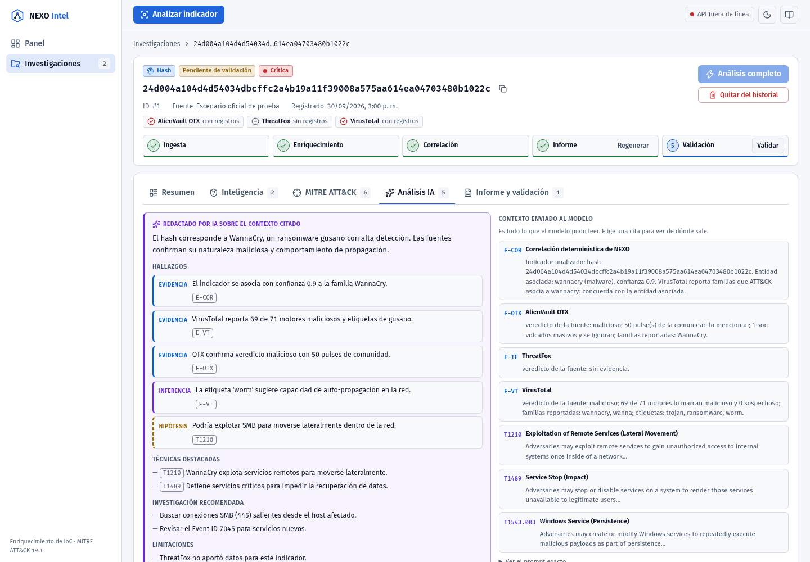
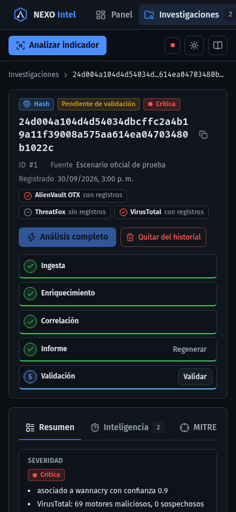

# Fase 5b — Detalle del indicador y trazabilidad de la IA

Fecha: 2026-09-30.

## Qué cambia

**Cabecera del caso:** tipo, estado y **severidad** (determinística, del informe más
reciente; "Sin evaluar" antes del primer informe); valor con copia; una **píldora por
fuente** (OTX, ThreatFox, VirusTotal) con su estado ("con registros", "sin registros", "no
respondió", "límite de cuota", "no configurada"…), donde el ícono y el texto, no solo el
color, distinguen hallazgo, fallo y ausencia.

**Aviso de cobertura parcial:** "Enriquecido con 1 de 2 fuentes · Sin datos de VirusTotal
(límite de cuota)… «no respondió» no equivale a «sin evidencia»", con **Reintentar
fuentes**. El backend reutiliza la caché de lo que respondió y solo repite lo que falló.
Las fuentes no configuradas o que no aplican al tipo no cuentan.

**Pipeline compacto:** el *stepper* de 5 tarjetas pasó a una fila de 40 px, solo con CSS.
Sus acciones (Ejecutar, Reintentar, Regenerar, Validar) se conservan; la descripción de
cada paso queda para lectores de pantalla y como *tooltip*.

**Pestañas** (antes: Enriquecimiento · ATT&CK · Informe · Validación):

| Pestaña | Contenido |
|---|---|
| **Resumen** | Severidad con sus motivos; **concordancia entre fuentes** ("VirusTotal contradice la asociación: sus familias apuntan a sunburst"); resumen de la IA en violeta con enlace al análisis; cadena de evidencia |
| **Inteligencia** | Una tarjeta por fuente: veredicto, **barra de detecciones** de VirusTotal (69/71), pulses y volcados ignorados, registros y confianza de ThreatFox, familias, etiquetas, fechas, latencia o "desde caché" y enlace a la fuente. Debajo, el detalle de OTX existente (pulses, validaciones, JSON crudo) |
| **MITRE ATT&CK** | La agrupación por táctica de siempre (determinística). Las técnicas que la IA destacó llevan la marca **IA** con su motivo; la lista no cambia |
| **Análisis IA** | Conclusión redactada por IA (violeta) con hallazgos **evidencia / inferencia / hipótesis**; cada cita (`E-VT`, `T1210`…) es un botón que **resalta su bloque** en el panel "Contexto enviado al modelo"; prompt exacto desplegable; pie con proveedor, modelo, latencia, tokens, respaldo usado y afirmaciones descartadas; aviso: *"las citas garantizan de dónde sale cada afirmación, no que sea correcta"* (hallazgo de la F4) |
| **Informe y validación** | El informe en Markdown y la decisión del analista, en la misma pestaña: se decide sobre lo que se lee |

**Estados sin análisis, explicados en vez de vacíos:** "No se consultó al modelo" (sin
entidad: por diseño), "El modelo no respondió" (con cada intento y su error), "Se descartó
todo lo que redactó el modelo" (con lo descartado y el motivo), e "Informe anterior a la
trazabilidad de IA" para informes guardados antes de la Fase 4.

**Apertura:** un caso nuevo o con informe abre en **Resumen** (ahí se ve avanzar el
análisis automático); uno a medias, en la pestaña del paso más avanzado. "Análisis
completo" termina en Resumen.

**Backend (ajuste menor):** la cabecera del Markdown (Tipo, Fecha, Confianza, Severidad)
usa saltos de línea duros (`"  \n"`); con `"\n"` se renderizaba como un solo párrafo.
Test agregado en `tests/test_reporting.py`; 284 tests del backend en verde.

## Defectos encontrados durante la fase

- **Foco perdido en las citas.** El botón de cita estaba definido dentro del componente
  del panel: React lo tomaba como un tipo nuevo en cada render y lo desmontaba al hacer
  clic, así que el foco del teclado se perdía. Lo detectó el test (el elemento quedaba
  desconectado); ahora es un componente de nivel superior.
- **Pestaña inicial durante el análisis automático.** Un caso recién registrado abría en
  "Inteligencia" con un estado vacío mientras el análisis corría. Ahora abre en Resumen.
- Se quitó la nota obsoleta sobre "Estado de validación" (sección que el backend ya no genera).

## Capturas

| | |
|---|---|
|  |  |
|  |  |
|  |  |

## Verificación

- `npm run lint`, `npm run typecheck`, `npm run build`: sin errores.
- `npm run coverage`: **129 tests**, 99,1 % sentencias · 95,5 % ramas · 99,3 % funciones ·
  99,5 % líneas.
- `App.test.tsx`: el flujo completo verifica severidad en cabecera y resumen, píldoras por
  fuente, motivos, concordancia, resumen de la IA, que una cita resalta y libera su bloque
  de contexto (`aria-pressed` / `aria-current`), proveedor, modelo y tokens, tarjetas de
  fuente (barra de detección con nombre accesible, volcados ignorados, "sin registros") y
  la marca IA en ATT&CK. El caso benigno verifica cobertura parcial, "NO significa sin
  evidencia", **Reintentar fuentes** e informe sin metadatos.
- Tests nuevos: `AiAnalysisPanel.test.tsx` (no llamado, fallido con intentos, descartado,
  respaldo y descartes en el pie), `SummaryPanel.test.tsx` (discrepancia — el caso real
  SolarWinds/BlackCat de la F4 —, sugerencia, sin informe) y `domain/severity.test.ts`
  (cobertura de fuentes, metadatos del último informe y tolerancia a informes antiguos).
- Revisión visual con Chrome headless en oscuro, claro y 390 px. Correcciones derivadas:
  tarjeta "sin registros" vacía, botón de la cabecera partido en móvil, píldora de la API
  reducida a un punto en pantallas muy angostas.
